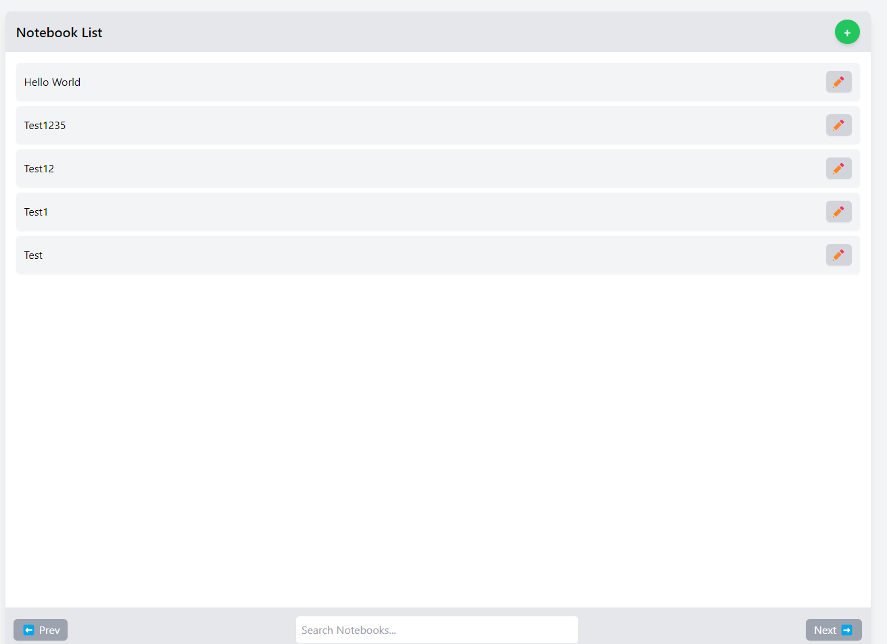
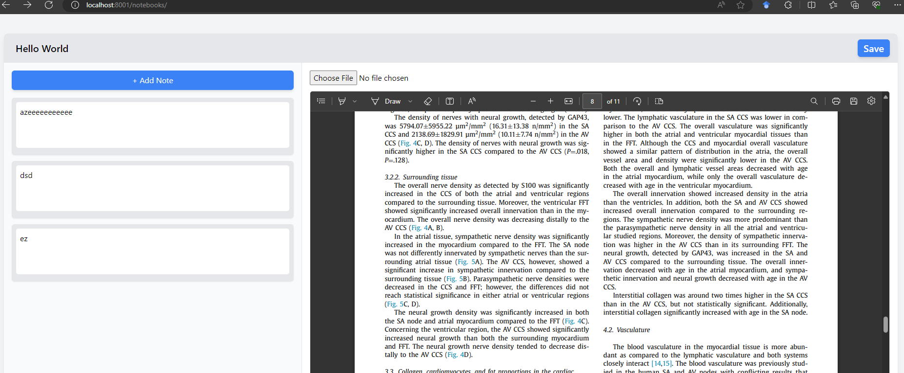

# 📒 Notebooks 

Yet a simple notebooks manager, open source script for PhD student

## 🚀 Features
- Create and manage multiple notebooks
- Add, edit, and delete notes
- Attach and view PDF files
- Simple and user-friendly UI

## 🛠️ Technologies Used
- HTML, CSS (TailwindCSS)
- JavaScript (Vanilla JS)
- PHP (Backend)
- MySQL (Database)

## 📦 Installation
1. Clone the repository:
   ```sh
   git clone https://github.com/aissatAbderrahmane/notebooks.git
   ```
2. Navigate to the project directory:
   ```sh
   cd notebooks
   ```
3. Set up your database and import the provided SQL file.
4. Configure database connection in php related files.
5. Start a local server:
   ```sh
   php -S localhost:8000
   ```

## 📝 Usage
- Open `http://localhost:8000` in your browser.
- Create a new notebook and add notes.
- Upload and view PDF files.



## 🤝 Contributing
Pull requests are welcome! Feel free to open an issue for suggestions.


